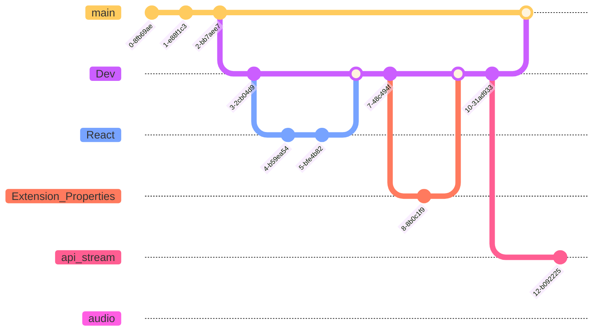

# Loudness - Visualizer :
[](https://github.com/Aubert-Antoine/loudness-visualizer/blob/master/LICENSE.GPL)
[](https://gitHub.com/Aubert-Antoine/loudness-visualizer/graphs/commit-activity)


> **Note** :
> Loudness - Visualizer is a personal, ongoing project. It is a Chrome extension, which is able to retrieve the audio stream of the current web page and display the sound strength in several ways. 

**Check there sections**
> **[`issues`](https://github.com/Aubert-Antoine/loudness-visualizer/issues)**
> **[`discussions`](https://github.com/Aubert-Antoine/loudness-visualizer/discussions)**

## Code information

### Load the extension :

Load the extension on Chrome [**here**](chrome://extensions/) and select `./dist`.
The code make in the `./src` folder is transcript in the `./dist` thanks to [*webpack*](https://webpack.js.org/)

### The **`yarn commands`** :

```
yarn run dev --watch

```

`yarn run webpack --watch --progress --config webpack.prod.js` = yarn run build

### The Git Graph :



### Yarn :

> **Warning**
> npm is needed to run the code :

```
npm install --save-dev style-loader         
npm install --save-dev css-loader           
npm install --save-dev postcss-loader postcss
npm install tailwindcss@latest
npm list  
```
_some package have been added both with npm and yarn because yarn packages are not load correctly_

> yarn is needed to run the code :
```
yarn init -y
yarn add react react-dom
yarn add webpack webpack-cli --dev
yarn add ts-loader
yarn add -D copy-webpack-plugin
yarn add -D html-webpack-plugin
yarn add -D postcss-loader
yarn add -D @types/react @types/react-dom @types/chrome
yarn add -D webpack-merge
```

and type script
`yarn add global typescript`

import React from "react";
import ReactDOM from "react-dom";
import {createRoot} from "react-dom/client";